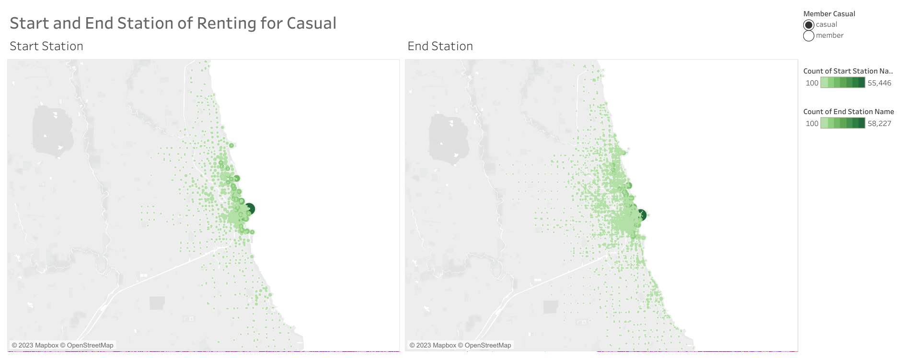
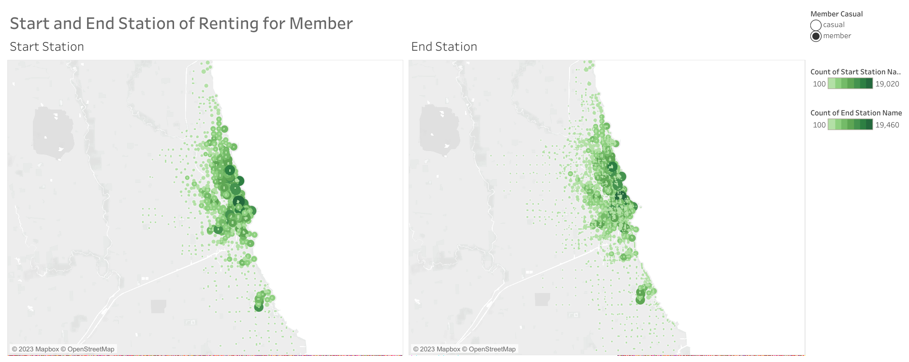

<style type="text/css">
  body{
  font-size: 12pt;
}
</style>

```{r setup, echo=FALSE}
knitr::opts_chunk$set(warning=FALSE, message=FALSE)
```

# Cyclistic Case Study Project {.tabset}

## Business Objectives
**Background**

In 2016, Cyclistic (a fictional company) launched a successful bike-share offering. The bikes can be unlocked from one station and returned to any other station in the system anytime.

Cyclistic has three main pricing plans: single-ride passes, full-day passes, and annual memberships. Customers who purchase single-ride or full-day passes are referred to as casual riders. Customers who purchase annual memberships are Cyclistic members.

Cyclistic’s finance analysts have concluded that annual members are much more profitable than casual riders. Although the pricing flexibility helps Cyclistic attract more customers, Moreno (The director marketing) believes that maximizing the number of annual members will be key to future growth. Rather than creating a marketing campaign that targets all-new customers, Moreno believes there is a very good chance to convert casual riders into members.

------------------------------------------------

**To do task**

As mentioned before, Moreno believes to increase growth is by converting casual riders into membership. however, the marketing analyst team needs to better understand how annual members and casual riders differ, why casual riders would buy a membership, and how digital media could affect their marketing tactics. So the business task will be *Analyse the historical bike trip data of membership and casual riders to know the difference between them*

The deliverables for this project is:

1. Data cleaning and manipulation process
2. A summary of the analysis
3. My recommendations from the analysis result


## Data Set

The data is Cyclistic's historical trip data to analyze and identify trends. [You can download the data from here](https://divvy-tripdata.s3.amazonaws.com/index.html). The dataset is from Divvy Bicycle sharing service that has been licensed by Lyft Bikes and Scooters, LLC (“Bikeshare) you can check the license agreement [here](https://www.divvybikes.com/data-license-agreement). The data set itself consist of 12 CSV files for each month in 2021.

## Data Cleaning and Manipulation

After the data has been downloaded, I am using R for organizing all the CSV and cleaning the data.

1. Load the needed library
```{r loading library}
library(tidyverse)
library(dplyr)
library(glue)
library(data.table)
library(hms)
```
<br>

2. First step was to put all the csv files (12 files) into a list by using `list.files()` function, and then using `map_df(~read_csv(.))` to read each of the csv files in the list and return it into a data frame.
<br>

```{r combine csv files to one dataframe, eval=FALSE}
setwd('C:/Data Portofolio/Case Study 1/Data/Dataset_2021')
df <- list.files('C:/Data Portofolio/Case Study 1/Data/Dataset_2021', pattern='*.csv') %>% 
  map_df(~read_csv(.x))
```
<br>

3. change `member_casual` data type into factor, separate `started_at` & `ended_at` data type into date and time column
```{r member_casual as factor, eval=FALSE}
df$member_casual <- as.factor(df$member_casual)
df$started_date <- as.Date(df$started_at)
df$ended_date <- as.Date(df$ended_at)
df$start_time <- as_hms(df$started_at)
df$ended_time <- as_hms(df$ended_at)
glimpse(df)
```
<br>

4. remove all the duplicate rows (if any) in the data frame
```{r removing duplicates, eval=FALSE}
df %>%  
  distinct()
```
<br>

5. Check if there is any missing values in the data frame
```{r checking na values in the data frame, eval=FALSE}
 colSums(is.na(df))
```
<br>

6. separate na values and make new data frame for further analysis if needed while removing the na values from the original data frame
```{r remove na, eval=FALSE}
df2 <- df %>% 
  filter(!complete.cases(.))
df <- df %>% 
  drop_na(start_station_name, start_station_id, end_station_name, end_station_id)
```
<br>

7. Make a new column of `ride_length` which calculate the duration bike use and `day_of_the_week` of the renting
```{r add column, eval=FALSE}
df <- df %>% 
  mutate(ride_length = ended_at - started_at,
         day_of_the_week = lubridate::wday(df$started_at, label=TRUE))

df$ride_length <- as.numeric(df$ride_length)
```
<br>

8. Remove rows that have minus ride length
```{r remove outlier minus ride length, eval=FALSE}
df <- df[df$ride_length >= 0,]
```
<br>

9. Check how many rows that have `ride_length` more than from one day
```{r check outlier more than one day, eval=FALSE}
df %>% 
  filter(ride_length>86400) %>% glimpse()
```

<br>

10. As there is only 1,275 rows from 4.5 millions, I believe this rows is an outliers and decided to remove them
```{r remove outlier , eval=FALSE}
df <- df %>%
  filter(ride_length<=86400) %>% glimpse()
```
<br>

11. Write the cleaned csv files into the other folder
```{r write the files, eval=FALSE}
fwrite(df, "C:\\bike_data_2021.csv")
```


## Analysis 
### Summary of the analysis
As mentioned in the business objectives tab, the task that we need to do is analyze the historical data and see how casual riders differ from membership riders. And the result of my analysis is that

<br>

<span style="font-size:18px">
<span style="color:red">**Casual**</span> riders use bikes for fun and leisure;
<span style="color:blue">**Member**</span> use bikes for commuting</span>

<br>

Please go to [Key Findings] for the detailed analysis and visualization of how I reached this conclusion. 
<br>

However, a lack of pricing and subscription price information makes me unable to find out what the benefit of casual riders getting a membership is and how the digital marketing team can use media to influence the casual riders to join. Please look at the recommendations tab to see my own opinion on how the Cyclistic Team should proceed.

<br>

### Key Findings
<br>

```{r load the dataframe, echo=FALSE}
setwd('C:\\Data Portofolio\\Case Study 1\\CleanedData')
df <- fread("bike_data_2021.csv")

df$start_time <- as_hms(df$started_at)
df$ended_time <- as_hms(df$ended_at)
df$day_of_the_week <- factor((df$day_of_the_week), levels = c("Mon", "Tue", "Wed", "Thu", 
"Fri", "Sat", "Sun"))
```

**Start renting time between casual and member**
<br>

Since there is data about time of when the renting began, then we can analyse at when casual riders start rent compared to member starting rent time.

<br>

```{r renting time difference, echo=FALSE}
df %>% 
  group_by("start_time" = hour(start_time), member_casual) %>% 
  summarise(count=n()) %>% 
  ggplot(aes(start_time,count,color=member_casual)) + 
    geom_line(size=1)+
    scale_x_continuous(breaks = scales::pretty_breaks(n=9),
                      labels = function(x) glue("{x}:00")) +
    scale_y_continuous(labels = scales::comma) +
    labs(x = "Rent Time Start",
         y = "Bike Amount",
         title = "Rent Time Difference Between Member and Casual Riders",
         color = "Type of Subscription") +
    theme_light()
```
<br>

On the given plot, the peak rental time for casual riders (orange line) is approximately 17 o'clock. On the other hand, we can see that the member's (blue line) start time has two spikes, with the first around 6 to 8 o'clock and the peak is around 15 to 17 o'clock. Both 6 to 8 o'clock and 15 to 17 o'clock are rush hour times for working hours. However, since casual riders do not have a spike in rental time during the morning rush hour, I assume that casual riders peak rental times of 15 to 17 o'clock are not because of rush hours. My hypothesis for now is that member riders use bike rent for commuting while casual riders use it for fun and leisure. We need to look at the day of the week for the difference in ride time between casual and membership riders in order to confirm this.

<br>
<br>

**Casual and Member behavior based on the day of the week**
<br>

```{r DoTW total member, echo=FALSE}
df %>%  
  group_by(member_casual, day_of_the_week) %>% 
  summarise(average_ride_length = mean(ride_length),
            total_members=n()) %>% 
  ggplot(aes(x=day_of_the_week, y = total_members))+ 
    geom_bar(position = "dodge", stat="identity", fill="ivory", alpha=0.5, color="black") +
    facet_wrap(~member_casual) + 
    theme_bw() +
  scale_y_continuous(labels = scales::comma) +
    labs(x = "Day of The Week",
         y = "Total Bike Rent",
         title = "Average Ride Length difference Between Member and Casual riders")
```
<br>

The total bike rent for casual riders has significantly increased from weekdays (Monday to Friday) to weekends (Saturday and Sunday), while for members, it is actually the reverse, where weekdays have more bike rent compared to weekends. 

<br>

```{r average ride length DoTW, echo=FALSE}
df %>%  
  group_by(member_casual, day_of_the_week) %>% 
  summarise(average_ride_length = mean(ride_length),
            total_members=n()) %>% 
  ggplot(aes(x=day_of_the_week, y = average_ride_length/60))+ 
    geom_bar(position = "dodge", stat="identity", fill="ivory", alpha=0.5, color="black") +
    facet_wrap(~member_casual) + 
    theme_bw() +
  scale_y_continuous(labels = scales::comma) +
    labs(x = "Day of The Week",
         y = "Average ride length (minute)",
         title = "Average Ride Length difference Between Member and Casual riders")
```
<br>

And if we look at the plot to compare average ride length between casual and member riders, we can see that casual riders have a higher average ride length compared to members, where the average length between all days is very similar. This data is able to confirm my hypothesis that casual riders use it for leisure (higher rent and longer rides on weekends), while members use it for commuting (higher rent on Weekdays and similar ride length between days). For stronger evidence I try to see the total bike rent between seasons.

<br>
<br>

**Bike rent based on Seasons**
<br>

```{r seasonal difference, echo=FALSE}
df %>% 
  select(member_casual, started_date) %>% 
  mutate(season = case_when(month(.$started_date) >=3 & month(.$started_date)<=4 ~ "Spring",
                            month(.$started_date) >=6 & month(.$started_date)<=8 ~ "Summer",
                            month(.$started_date) >=9 & month(.$started_date)<=11 ~ "Fall",
                            .default = "Winter")) %>% 
  group_by(member_casual, season) %>% 
  summarise(count=n()) %>% 
  ggplot(aes(fill=member_casual, y=count, x=season)) + 
    geom_bar(position="fill", stat='identity', alpha=0.1, color="black") + 
    scale_y_continuous(labels = scales::percent) +
    coord_flip() +
    labs(y = " ",
         x = "Season",
         fill = "Type of Subscription",
         title = "Total of Bike Rent per Season Between Subscription") +
    theme_bw()
```
<br>

The overall amount of bikes rented out by members is always higher, with the exception of the summer, which is a holiday season. This data again confirms my hypothesis that casual riders use bike rentals for leisure while members use them for commuting.
<br>

Lastly, since there is data about latitude and longitude for the stations, I decided to use Tableau to see the geographical map on start station and end station between casual and member.

<br>
<br>

**Start and End station based on maps**
<br>

```{r casual start end station, echo=FALSE, fig.alt="Casual Geo", out.width='100%'}

```

```{r member start end station, echo=FALSE, fig.alt="Member Geo", out.width='100%'}

```
<br>

We can see that there is a significant difference in the picture between casual and member riders. For the member riders the start and end station names is spread across the map. this support the idea that member riders use bikes for commuting. For the casual riders, the start and end station names is focused on one of the station near the coast line, which is a recreation area.
<br>

These noteworthy facts, in my opinion, are sufficient to prove that casual riders use bicycles for recreation while member riders use bicycles for commuting.

## Recommendations
Moreno wants to improve the company growth by converting casual riders into member. Looking at the analysis result there are two recommendation that I can give to the Cyclistic team

1. Redesign the strategies to improve growth

Given the historical data and the analysis's findings, I believe it would be challenging to convert casual riders into members because their behavior differs from that of member riders. The majority of casual riders only utilize bike rentals during the holidays or on the weekends, and they only rent bikes for fun and leisure. Since I feel casual riders are a distinct target market than member riders, I do not see a big benefit in converting them to members.
<br>

2. Gather more data

If the Cyclistic team still wants to go with the idea of converting casual riders into members, then I believe obtaining more information and data is an essential thing to do.


* Data about pricing plans  
     In this project, unfortunately, there is no data about the difference in pricing between casuals and members. If we have the pricing data, then we can do a cost-benefit analysis (such as distance and hours of rentals pricing compared to subscription plan) that will be more effective in convincing casual riders to convert to members if it is indeed beneficial for them to do so.
     
* Customer survey of why they use bike rentals  
     In this analysis, I conclude that casual riders use bike rentals for fun while members use them for commuting based on historical data. But I believe directly asking the customer what their intention is for using bike rentals will be more effective. And later on, based on the result of the survey, if there is indeed a similarity between casual and member riders, then the idea of converting casual riders into members will be more sound.
     
* Health and age condition of riders  
    If we are able to gather data about the health and age conditions of riders, and if the data shows that the member riders indeed have better health conditions compared to casual riders since they use bike rentals more often to commute, then we can use digital media to influence the benefits that casual riders get in terms of lifestyle and health.